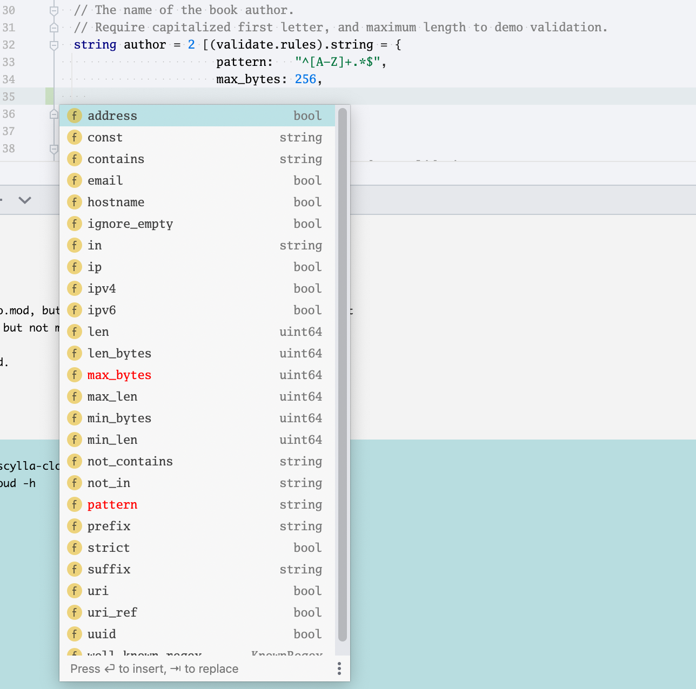

# Scylla Cloud new framework API

## Tools used

- Protobuf - IDL
- [Buf](https://buf.build) - protoc + yaml config + breaking changes detection + linting
  - protoc-gen-twirp - RPC
  - protoc-gen-twirp-swagger
  - protoc-gen-openapiv2 (from grpc-gateway)
  - protoc-gen-validate (from envoy proxy)
- [go-swagger](https://github.com/go-swagger/go-swagger) - server and client code generation
- [Swagger UI](https://swagger.io/tools/swagger-ui/) - service documentation
- [Cobra](https://github.com/spf13/cobra) - CLI building
- [Viper](https://github.com/spf13/viper) - CLI flags from ENV variables
- [Echo](http://echo.labstack.com) - HTTP server + **middleware**
- [Skaffold](https://skaffold.dev) (Google) - productivity tool for k8s, streamlined local deployments, file watching (in progress)
- Golang CI

## Result

* IDL based
  * service definition
  * validation rules
  * REST API - able to mix and match, extend, modify service objects and APIs
* Generated
  * service stub
  * REST API server
  * REST API CLI
* Services and REST API documented with embedded Swagger UI
* Secure HTTP server foundation (based on Echo)
  * Panic recovery
  * Request timeout
  * Request body limit
  * Gzip compression / decompression
  * Mitigation of XSS and other injection attacks 
  * CORS
  * CSRF
  * Rate limiting
* Secure HTTP clients - configured defaults based on HC clean http
* HTTP/2
* Integration with
  * Prometheus
  * Jaeger
  * Pprof
* Logging and debug mode with full header body dumps, based on scylladb/go-log (console mode)
* Single binary / container
* Automated deploys to k8s with scaffold.dev
* Custom protoc plugin to add embedding of generated swagger files
* Found bug in go-swagger, sent [patch](https://github.com/go-swagger/go-swagger/pull/2736) (merged)

## Project structure

### Proto

* `proto/srv` - service API specification, DTOs, validation rules
* `proto/restapi` - restapi specification, imports and extends proto/srv items, uses grpc-gateway options to generate swagger

```
proto/
├── restapi
│   └── v1
│       └── restapi.proto
└── srv
    ├── book
    │   └── v1
    │       └── book.proto
    └── shelf
        └── v1
            └── shelf.proto
``` 

### Gen

* `gen/srv` - all generated files from `proto/srv`
* `gen/v2.swagger.json` - file generated from `proto/restapi`
* `gen/models`, `gen/restapi` - files generated from `v2.swagger.json`

```
gen/proto/srv/book/
└── v1
    ├── book.pb.go
    ├── book.pb.validate.go
    ├── book.swagger.json
    ├── book.swagger.json.go
    └── book.twirp.go
```

### Service

Implementation of `proto/srv` services.

```go
import (
	pb "github.com/scylladb/scylla-cloud/gen/proto/srv/book/v1"
	"github.com/twitchtv/twirp"
)

// Service is a twirp book service.
type Service struct {
	bookIDCounter int
	booksByID     map[string]*pb.Book
	mu            sync.Mutex
}

var _ pb.BookService = (*Service)(nil)
```

### Restapi

Implementation of `proto/restapi` services.

```go
import (
	"github.com/scylladb/scylla-cloud/gen/restapi"
	"github.com/go-openapi/runtime/middleware"
)

// Server provides a REST API Server.
type Server struct {
	book  book.BookService
	shelf shelf.ShelfService
}

var _ restapi.ServiceAPI = (*Server)(nil)

func (s *Server) ServiceCreateBook(ctx context.Context, params service.ServiceCreateBookParams) middleware.Responder {
	request := &book.CreateBookRequest{
		Book: &book.Book{
			Id:     params.Book.ID,
			Author: params.Book.Author,
			Title:  params.Book.Title,
			Read:   params.Book.Read,
		},
	}

	resp, err := s.book.CreateBook(ctx, request)
	if err != nil {
		return service.NewServiceGetBookInternalServerError().WithPayload(err.Error())
	}

	return service.NewServiceCreateBookOK().WithPayload(&models.V1CreateBookResponse{
		Book: &models.V1Book{
			Author: resp.Book.Author,
			ID:     resp.Book.Id,
			Read:   resp.Book.Read,
			Title:  resp.Book.Title,
		},
	})
}
```

### Cmd

Server binary

```
$ make build
$ source <(./scylla-cloud completion bash)
$ ./scylla-cloud -h

Usage:
scylla-cloud [command]

Available Commands:
api         API server
book        Book service
completion  Generate shell completion
help        Help about any command

Flags:
-h, --help   help for scylla-cloud

Use "scylla-cloud [command] --help" for more information about a command.
```

```
$ ./scylla-cloud api -h
API server

Usage:
scylla-cloud api [flags]

Flags:
--body-limit string    max body size (default "2M")
--book-addr string     twirp book endpoint (default "http://localhost:5080")
--cert-file string     tls certificate file
--debug                enable debug
-h, --help                 help for api
--http string          http address (default ":80")
--https string         https address
--key-file string      tls key file
--log string           log level (default "INFO")
--pprof string         http address of pprof debug endpoints (default ":5112")
--prom string          http address of prometheus metrics endpoint (default ":5090")
--rate-limit int       max number of requests per IP address per second (default 100)
--req-timeout string   max request processing time (default "30s")
--shelf-addr string    twirp shelf endpoint (default "http://localhost:5081")
```

### Others

* `swagger` - swagger UI distribution
* `dev-tools` - source code for custom-made tools 
* `bin` - installation path for tools - operated by make

## REST API in protobuf

Header

```protobuf
option (grpc.gateway.protoc_gen_openapiv2.options.openapiv2_swagger) = {
  info: {
    title: "API Server";
  };
  schemes: HTTP;
  schemes: HTTPS;
  consumes: "application/json";
  produces: "application/json";
  responses: {
    key: "403";
    value: {
      description: "Returned when the user does not have permission to access the resource.";
    }
  }
```

Endpoints

```protobuf
  // Creates a book, and returns the new Book.
  rpc CreateBook(proto.srv.book.v1.CreateBookRequest) returns (proto.srv.book.v1.CreateBookResponse) {
    option (google.api.http) = {
      post: "/v1/books"
      body: "book"
    };
  }
```

## Declarative validation



## Echo middleware

Batteries included echo provides lots of customizable middleware, see the list [here](https://echo.labstack.com/middleware/).

Example CSRFConfig

```go
type (
	// CSRFConfig defines the config for CSRF middleware.
	CSRFConfig struct {
		// Skipper defines a function to skip middleware.
		Skipper Skipper

		// TokenLength is the length of the generated token.
		TokenLength uint8 `yaml:"token_length"`
		// Optional. Default value 32.

		// TokenLookup is a string in the form of "<source>:<name>" or "<source>:<name>,<source>:<name>" that is used
		// to extract token from the request.
		// Optional. Default value "header:X-CSRF-Token".
		// Possible values:
		// - "header:<name>" or "header:<name>:<cut-prefix>"
		// - "query:<name>"
		// - "form:<name>"
		// Multiple sources example:
		// - "header:X-CSRF-Token,query:csrf"
		TokenLookup string `yaml:"token_lookup"`

		// Context key to store generated CSRF token into context.
		// Optional. Default value "csrf".
		ContextKey string `yaml:"context_key"`

		// Name of the CSRF cookie. This cookie will store CSRF token.
		// Optional. Default value "csrf".
		CookieName string `yaml:"cookie_name"`

		// Domain of the CSRF cookie.
		// Optional. Default value none.
		CookieDomain string `yaml:"cookie_domain"`

		// Path of the CSRF cookie.
		// Optional. Default value none.
		CookiePath string `yaml:"cookie_path"`

		// Max age (in seconds) of the CSRF cookie.
		// Optional. Default value 86400 (24hr).
		CookieMaxAge int `yaml:"cookie_max_age"`

		// Indicates if CSRF cookie is secure.
		// Optional. Default value false.
		CookieSecure bool `yaml:"cookie_secure"`

		// Indicates if CSRF cookie is HTTP only.
		// Optional. Default value false.
		CookieHTTPOnly bool `yaml:"cookie_http_only"`

		// Indicates SameSite mode of the CSRF cookie.
		// Optional. Default value SameSiteDefaultMode.
		CookieSameSite http.SameSite `yaml:"cookie_same_site"`
	}
)
```

